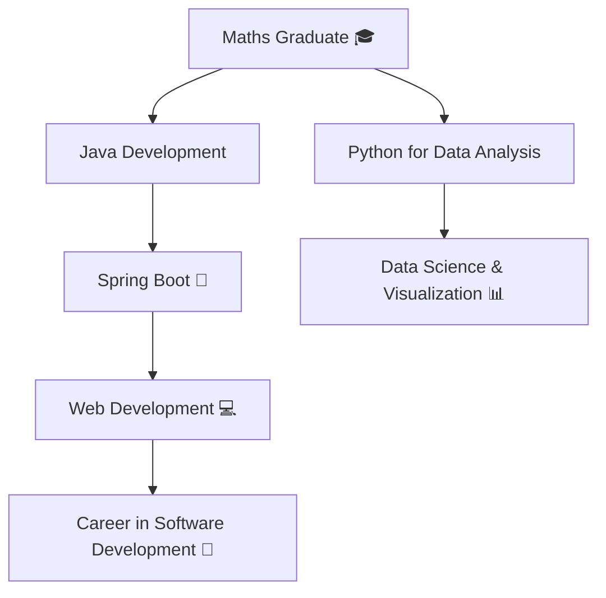

## Hi there 👋

# I'm Uğur Taşdelen

🎓 I'm a Mathematics graduate from **Ankara University**, with a strong passion for combining **mathematics with programming**.  
👨‍🏫 I'm focusing on a career in **Data Analysis** and **Software Development**.

---

## 💻 Tech Stack & Learning Path

### 🧠 Languages & Tools

---

### 🚀 Currently Learning

- Spring Boot & REST APIs  
- Data Structures & Algorithms  
- SQL for Data Analysis  
- Möbius Transformations  
- Java Web Development  

---

## 🎯 Goals

- 🧩 Become job-ready in **Java Web Development** using Spring Boot  
- 📊 Learn advanced **data analysis with Python and SQL**  
- 💡 Build and contribute to **open-source projects**

---

## 🎭 A Bit More About Me

- 🕹️ 8+ years of **Go (Weiqi)** playing experience  
- 🏕️ Loves **camping** and **drawing**  
- 💬 Enjoys exploring **math-programming intersections**

---

## 📈 My Progress Diagram

📫 Let's Connect

🌐 GitHub: github.com/UgurTasdelen

💼 LinkedIn: linkedin.com/in/ugurtasdelen

📧 Email: ugurtasdelen1234@gmail.com

"Mathematics is not about numbers, equations, computations, or algorithms: it is about understanding."
— William Paul Thurston
